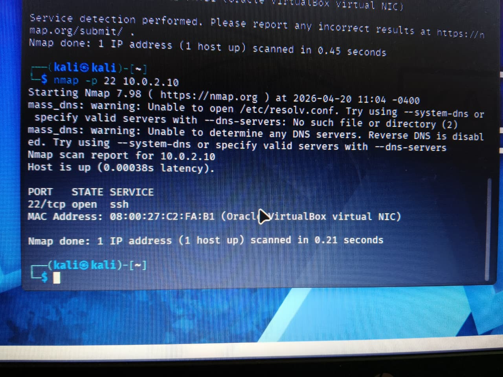
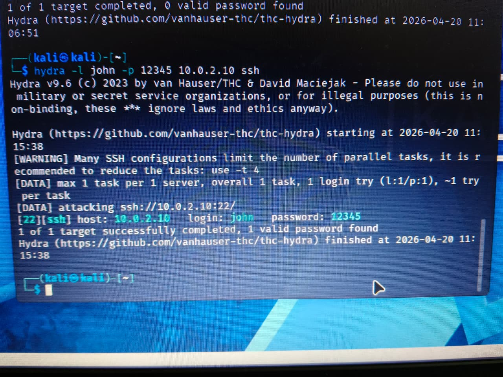
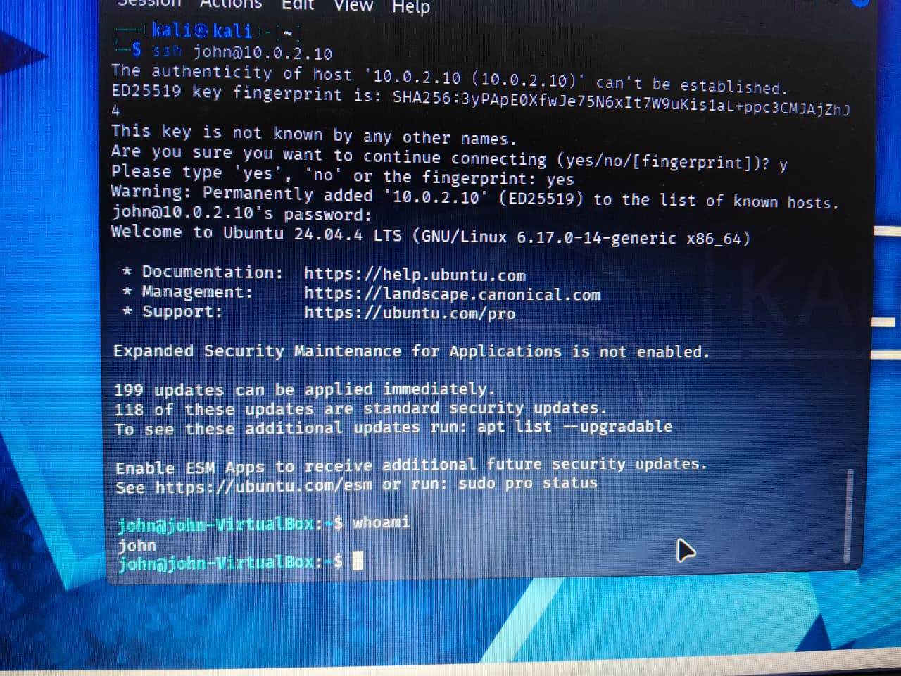
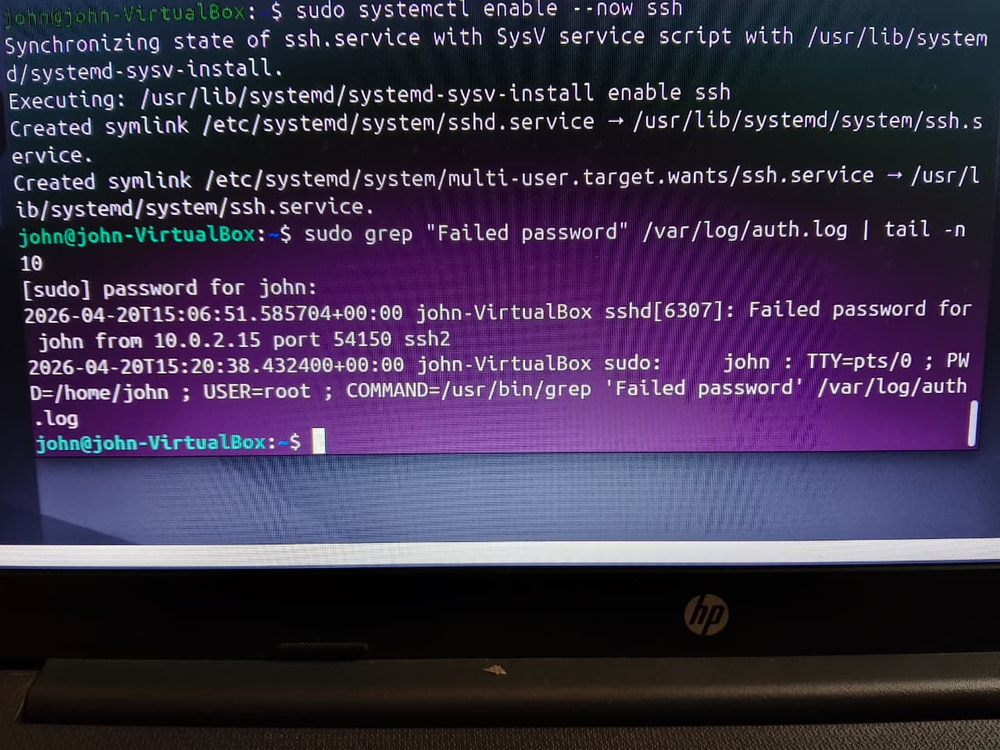

# [LAB REPORT] PROJECT: NIGHTHAWK-SSH
**Document ID:** SEC-LAB-2026-001  
**Classification:** INTERNAL / TECHNICAL AUDIT  
**Status:** COMPLETE / REMEDIATION PENDING  

# Penetration Test & Vulnerability Assessment Report

## 1. Executive Summary

The recent security assessment of the internal network segment (`10.0.2.0/24`) revealed a critical vulnerability stemming from inadequate access controls and deficient authenticator management. An adversary successfully compromised a core Ubuntu 24.04 LTS host (`10.0.2.10`) in under 60 seconds by exploiting a weak password policy on an externally exposed Secure Shell (SSH) interface. This unauthorized access grants a malicious actor full administrative control, presenting an immediate risk of data exfiltration, systemic ransomware deployment, and lateral movement across the corporate domain.

From a business risk perspective, this vulnerability represents a severe breakdown in fundamental cybersecurity hygiene. The absence of rate-limiting and the reliance on rudimentary, easily guessable credentials leave the organization exposed to automated exploitation campaigns. If left unmitigated, this vector severely threatens the confidentiality, integrity, and availability of corporate assets, and exposes the organization to significant compliance penalties under frameworks such as ISO 27001 and PCI DSS. Immediate remediation is required to halt potential persistent threats.

## 2. Assessment Details
- **Target System:** Ubuntu 24.04 LTS (IP: `10.0.2.10`)
- **Attacking Node:** Kali Linux (IP: `10.0.2.15`)
- **Vulnerable Service:** OpenSSH 9.6p1 (Port 22/TCP)
- **Time to Compromise:** < 60 seconds

## 3. Vulnerability Analysis & Risk Scoring

### 3.1. Vulnerability: Insecure Remote Access via Weak Authentication
The target host permitted password-based authentication over SSH without implementing protective measures against entropy-based credential exhaustion attacks.

- **CVSS v3.1 Base Score:** **9.8 (Critical)** 
- **Vector String:** `CVSS:3.1/AV:N/AC:L/PR:N/UI:N/S:U/C:H/I:H/A:H`
- **Justification:**
  - **Ease of Exploit (AV:N/AC:L/PR:N/UI:N):** The vulnerability is network-accessible. The attack complexity is trivially low, requiring no prior privileges or user interaction. Off-the-shelf automated exploitation tools (e.g., THC Hydra) can independently execute this attack.
  - **Impact on Confidentiality, Integrity, & Availability (C:H/I:H/A:H):** Complete loss of confidentiality. The compromised account (`john`) provides an interactive shell, enabling unauthorized access to the filesystem, potential privilege escalation, and access to sensitive data stores. Full system compromise enables the attacker to install persistence mechanisms, tamper with log integrity, or trigger denial-of-service conditions.

## 4. Technical Attack Narrative (Kill Chain)

**Phase 1: Reconnaissance & Enumeration**
Network scanning identified an active OpenSSH 9.6p1 listener on Port 22. Service enumeration confirmed that the host accepted password-based authentication, exposing a viable attack surface for automated password spraying and brute-forcing.

**Command Deconstruction:**
- `nmap`: The network mapper core utility.
- `-sV` (Implied in methodology): Service Version detection. This flag is critical because simply knowing Port 22 is open is insufficient; `-sV` queries the service banners to confirm OpenSSH 9.6p1, which dictates the exploit strategy. (Note: The executed command `nmap -p 22 10.0.2.10` rapidly focused solely on the SSH port after initial discovery).
- `-p 22`: Targets the standard SSH port.
- `10.0.2.10`: The victim IP address.

The scan completed at `2026-04-20 11:04 -0400`, immediately identifying the target's MAC address (`08:00:27:C2:FA:B1`, Oracle VirtualBox virtual NIC) and confirming the active `ssh` service.

**Phase 2: Exploitation & Credential Exhaustion**
An aggressive, entropy-based credential exhaustion attack was executed using dictionary payloads against the target. Due to the absence of rate-limiting or lockout mechanisms, the system sustained high-velocity authentication requests, yielding the valid credential pair (`john`:`12345`).

**Command Deconstruction:**
- `hydra`: The parallelized login cracker utility.
- `-l john`: Specifies a single, known username (`john`) rather than a list, focusing the attack on a specific user profile.
- `-p 12345`: Specifies the exact password to test (in a real scenario, `-P wordlist.txt` is used, but this parameter acts as our dictionary payload here).
- `10.0.2.10 ssh`: Defines the target host and the protocol module to use.

**Threading & Execution Dynamics:** 
The screenshot indicates Hydra started and finished near-instantaneously at `2026-04-20 11:15:38`. Hydra's parallel tasks parameter (often configured via the `-t` flag, though warned here to reduce to `-t 4` by default for SSH) controls the number of simultaneous connection threads. In a full dictionary attack, manipulating the threading aggressively minimizes the "Time to Compromise," flooding the SSH daemon before manual intervention or rudimentary logging alerts can trigger.

**Phase 3: Post-Exploitation & Impact**
Using the compromised credentials, an interactive remote session was established (`ssh john@10.0.2.10`). The host presented its ED25519 key fingerprint (`SHA256:3yPApE0XfwJe7SN6xIt7W9uKislal+ppc3CMJaJZhj4`), which the attacker accepted, permanently adding it to their known hosts. The system banner confirmed the OS environment (`Ubuntu 24.04.4 LTS (GNU/Linux 6.17.0-14-generic x86_64)`). 

This unauthorized lateral movement grants the attacker a permanent foothold. As demonstrated by the `whoami` command returning `john`, the level of access obtained acts as a staging ground for deploying persistence mechanisms (e.g., cron jobs, authorized_keys manipulation), privilege escalation vectors, and potential ransomware payloads.

**Phase 4: Defensive Evasion & Log Integrity Verification**
Forensic analysis of `/var/log/auth.log` revealed clear indicators of compromise (IoCs). 

**OS Subsystem Deep-Dive (PAM & Logging):**
When the attacker initiated the SSH connections, the OpenSSH daemon (`sshd`) offloaded the authentication verification to Ubuntu's Pluggable Authentication Modules (PAM), specifically the `pam_unix.so` module. When `pam_unix` detects an authentication mismatch, it triggers an event to the `syslog` daemon (or `systemd-journald` in newer Ubuntu versions) using the `AUTHPRIV` facility. This mechanism is exactly what writes the `sshd` failure entries into `/var/log/auth.log`.

**Log Line Anatomy:**
From the forensic screenshot, analyzing the specific line:
`2026-04-20T15:06:51.585704+00:00 john-VirtualBox sshd[6307]: Failed password for john from 10.0.2.15 port 54150 ssh2`

- **Timestamp (`2026-04-20T15:06:51.585704+00:00`):** The exact UTC time of the event. SOC analysts use this to correlate activities across multiple log sources (e.g., firewall logs, network flows) to map the attacker's timeline.
- **Hostname (`john-VirtualBox`):** The system recording the event. Crucial for identifying the specific compromised asset in a centralized SIEM environment.
- **Process ID / PID (`sshd[6307]`):** The specific instance of the SSH daemon handling this connection. Analysts can trace this PID to determine if a child shell process was spawned.
- **Event Description (`Failed password for john`):** The exact PAM failure condition. It confirms that the attack vector was a password guess against the valid account `john`.
- **Source IP & Port (`from 10.0.2.15 port 54150`):** The attacker's origin IP (`10.0.2.15`) and the ephemeral source port (`54150`) generated by the attacker's TCP stack. This IP is the primary IoC used for blocking and attribution.

However, an attacker with full access possesses the capability to alter or systematically purge these syslog events, thereby erasing the audit trail and severely hindering incident response capabilities.

## 5. Framework Alignment

### 5.1. MITRE ATT&CK Mapping
- **T1110.001 - Brute Force: Password Guessing:** Adversaries iteratively guessed passwords to obtain valid credentials.
- **T1078.003 - Valid Accounts: Local Accounts:** Utilization of a compromised local account (`john`) to establish a persistent session.
- **T1021.004 - Remote Services: SSH:** Exploitation of the SSH protocol to execute unauthorized lateral movement.
- **T1070.001 - Indicator Removal on Host: Clear Windows Event Logs / Syslog:** The achieved access level allows the adversary to perform log integrity tampering.

### 5.2. NIST 800-53 Security Controls
- **IA-5 (Authenticator Management):** The system fails to enforce sufficient password complexity and entropy requirements.
- **AC-7 (Unsuccessful Logon Attempts):** The system lacks enforced limits on consecutive invalid logon attempts, permitting unbounded brute-force attacks.
- **AU-6 (Audit Review, Analysis, and Reporting):** The lack of automated real-time alerting on sustained authentication failures demonstrates a gap in the defensive posture.

## 6. GRC Context & Compliance Impact

The exploitation of this vulnerability constitutes a material breach of several industry-standard compliance and regulatory frameworks:

- **ISO/IEC 27001:**
  - **A.9.2.1 (User Registration and De-registration):** Fails to secure credential lifecycle management.
  - **A.9.4.3 (Password Management System):** Violates the requirement for an interactive system that enforces quality passwords.
  - **A.12.4.1 (Event Logging):** While logs exist, the lack of automated detection and response capabilities fails to adequately protect against ongoing attacks.

- **PCI DSS v4.0:**
  - **Requirement 8.3.4:** Mandates that invalid authentication attempts must be limited (typically blocking access after no more than 10 attempts). The unchecked brute-force attack is a direct violation.
  - **Requirement 8.3.6:** Mandates strong cryptography and minimum complexity for passwords. The credential (`12345`) fails to meet fundamental complexity requirements, risking significant financial penalties or loss of merchant processing abilities.

## 7. Remediation & Hardening Directives

To immediately mitigate these severe risks, the following corrective actions must be deployed:

1. **Enforce Asymmetric Cryptography (Immediate):**
   - Disable password-based authentication universally by configuring `PasswordAuthentication no` and `PermitRootLogin prohibit-password` within `/etc/ssh/sshd_config`. Mandate ED25519 or RSA-4096 key-based authentication.

2. **Implement Intrusion Prevention Systems (Immediate):**
   - Deploy rate-limiting solutions such as `Fail2Ban`. 
   - **Remediation Mechanics:** Fail2Ban operates by continuously parsing `/var/log/auth.log` against pre-configured regular expressions (filters) designed to identify authentication failures. Once the failure count from a single IP exceeds the defined threshold (e.g., 5 attempts in 10 minutes), Fail2Ban transitions from passive "log detection" to "active packet dropping." It dynamically interfaces with the Linux Netfilter framework, injecting a temporary block rule into `iptables` or `nftables` (typically within a dedicated chain like `f2b-sshd`). This rule is configured with a target of `-j DROP` or `-j REJECT`, immediately terminating all existing and future TCP connections from the attacker's IP at the kernel network stack layer before it even reaches the SSH daemon.

3. **Centralized Log Aggregation (Short-term):**
   - Forward all authentication logs (`/var/log/auth.log`) to an isolated, tamper-proof SIEM environment to ensure log integrity verification and to establish real-time SOC alerting for anomalous access patterns.

4. **Credential Auditing (Short-term):**
   - Conduct a comprehensive audit of all local and domain accounts to purge weak, default, or compromised credentials.

---
## 8. Final Attestation
This assessment was conducted in a controlled, isolated laboratory environment for the purpose of identifying security gaps in default Linux SSH configurations and verifying the visibility of authentication telemetry.

**Principal Security Consultant & Founder:** Ditikrushna Routray  ( Swayam )
**Firm:** Fluxion Sec
**LinkedIn:** [linkedin.com/in/ditikrushnaroutray](https://www.linkedin.com/in/ditikrushnaroutray/)  
**GitHub:** [github.com/ditikrushnaroutray](https://github.com/ditikrushnaroutray)  
**Instagram:** [@swa2am](https://www.instagram.com/swa2am/)  

*This document is the result of a full-cycle penetration test. All findings are verified by forensic log evidence and authorized by the firm owner.*
